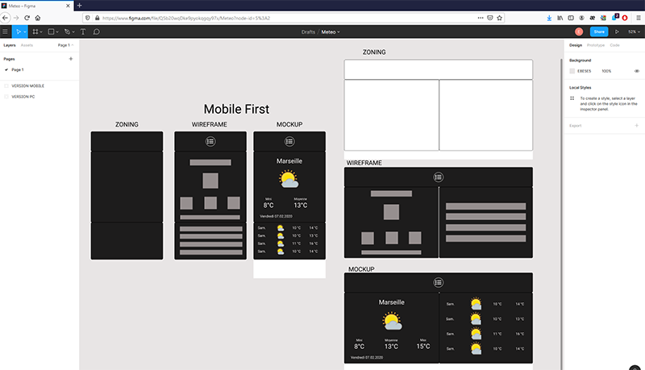

## Utiliser un web service (meteo)
## [Application web 2.0](https://ricou12.github.io/meteo-webService/)

### Réalisation d'une maquette à l'aide l'outils en ligne FIGMA.

Version mobile et desktop

Interface fonctionnel: Zoning,wireFrame,Prototype.
Interface Graphique: StyleGuide, mockup.

